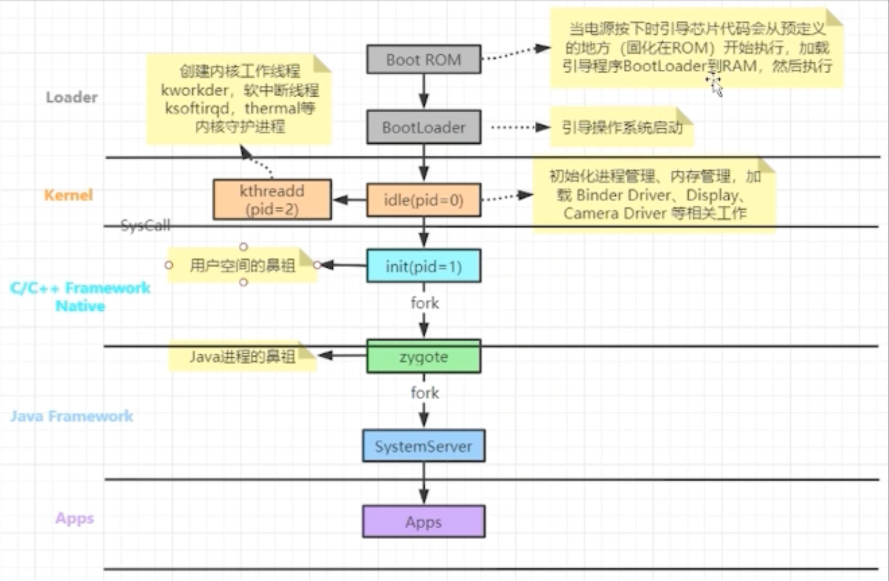
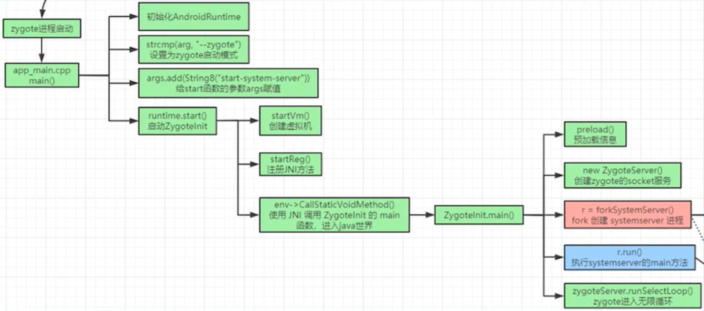
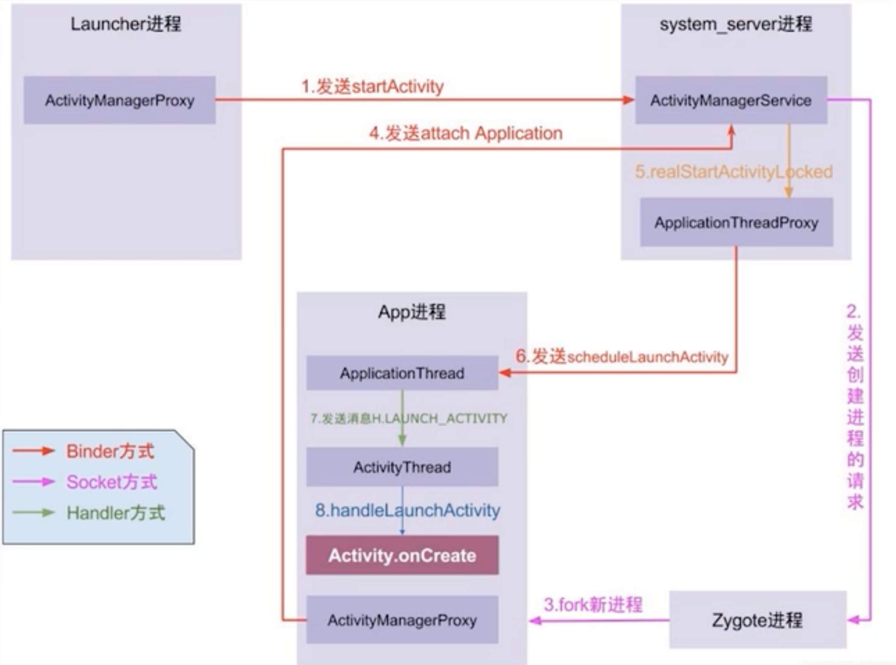

    <h1>AMS & WMS 基础</h1>

# 安卓启动流程

ROM：只读存储器，里面有硬件层面写死的引导程序，断电后数据不会丢失。ROM启动后将程序加载到RAM里再运行。

RAM：随机存储器，可写入，断点后数据丢失，相当于内存。启动BootLoader。

BootLoader：加载操作系统，开始启动内核的第一个进程。

# Zygote启动流程

system\_service就是SystemService

### 为什么安卓系统要一个进程分配一个虚拟机？

1、隔离内存，方便虚拟机管理内存

2、隔离风险，沙箱机制

### ZygoteInit初始化的时候为什么要preload？

预加载会加载哪些：一部分framwork资源、常用java类、一些基础库

这样做可以加快应用进程的启动速度

### 启动ZygoteService干嘛的？

启动soeckt通信

#### 这里为什么不用Binder？

1、这里Binder还未初始化完成

2、Binder是多线程机制，fork是写时拷贝，多线程下可能会死锁。

### runSelectLoop是干嘛的？

这是类似于Handler的消息机制，不停死循环，等待AMS给他发消息来创建进程。

### AMS

ZygoteInit -> fork -> 启动SystemServer -> 创建ATMS、创建StackSupervisor、创建AMS ->

SystemServer中启动ATMS，在ServiceManager中加入系统服务，AMS会创建生命周期管理对象（ClientLifecycleManager）

然后启动AMS，AMS启动栈管理对象：StackSupervisor

这里还会启动WMS（WindowManagerService）。

### Activity启动流程

首先Launcher进程会通过ActivityManagerProxy会调用startActivity、startActivityForResult、然后一路调用到Instrumentation.execStartActivity里来。

然后会通过Binder跨进程通知到AMS（AMS属于system\_server里的一个服务）。

AMS会判断这个Activity的进程是否已经存在了。如果存在则直接启动。否则需要先通过Socket通知zygote进程去fork新的进程出来。

新的进程启动后，新进程的ActivityManagerProxy会通过attachApplication把ApplicationThread给到AMS。AMS拿到ApplicationThread后可以再走回原本的启动路线。

ActivityThreadProxy再通过scheduleLaunchActivity来获取到对应进程的ApplicationThread，然后，对应进程的ApplicationThread再通过Handler将启动Activity的消息发送到ActivityThread。

ActivityThread会调用handleLaunchActivity来启动。
