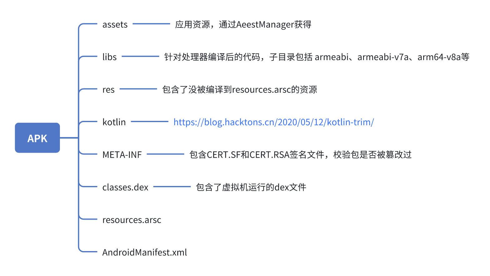
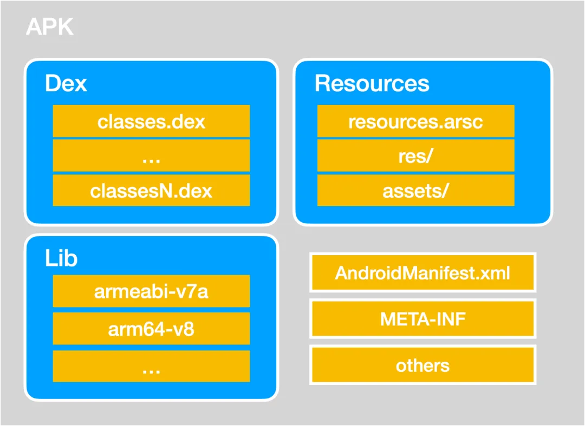

    <h1>APK结构分析</h1>

* classes.dex APK 中可能包含一个或多个 classes.dex 文件，应用程序内的 Java/Kotlin 源码最终会以 dalvik 字节码的方式存在于 classes.dex 文件中。
* resources.arsc 该文件是包含配置信息的资源查询表，起着链接代码与资源的作用。Dex 文件中的 R.class 仅包含资源 id，AssetManager 会利用 id 到 arsc 表中查询与当前设备信息最匹配的资源文件路径（或资源内容）。
* res/ 包含源码工程中 res 目录下除了 values 外的资源文件，这些文件路径同时会体现在 resources.arsc 中。
* lib/ native libraries。即源码工程 jni 目录下的 so 文件，二级目录必须为 NDK支持的 ABI。
* assets/ 与 res/ 资源目录不同，assets/ 下的资源文件不会在 resources.arsc 中生成查询条目，且 assets/ 下的资源目录可完全自定义，业务代码获取 assets 资源和 res 资源的方式也完全不同。
* META-INF/ 应用签名信息。该目录在应用签名后生成，包含以下三个文件： MANIFEST.MF：摘要文件，包含APK内所有文件的路径及其 SHA1/SHA256 值。 CERT.SF：对摘要的签名文件，包含APK内所有文件的路径，及其在 MANIFEST.MF 中对应信息的 SHA1/SHA256 值。 CERT.RSA：保存公钥、加密算法及其私钥加密后的内容。
* AndroidManifest.xml 应用清单文件，用于描述应用基本信息，主要包括应用包名、应用id、应用组件、所需权限、设备兼容性等。
