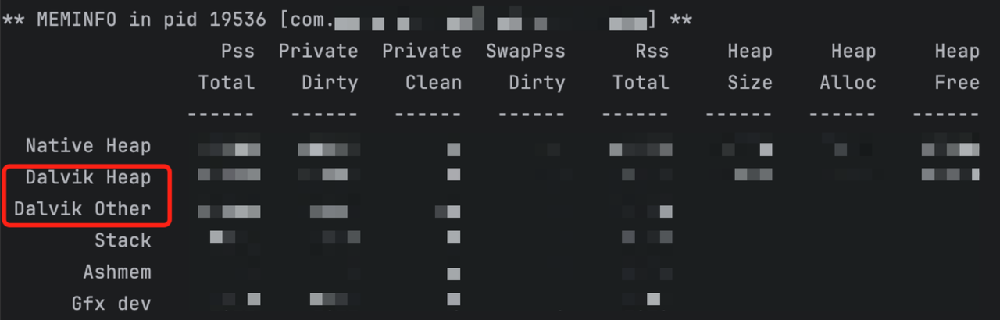
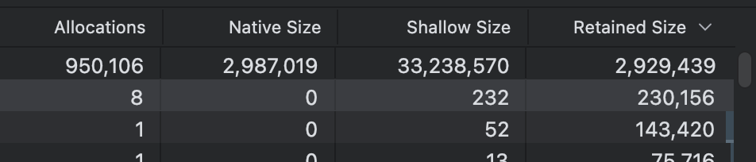

<div align=center>
    <h1>安卓内存优化参数详情</h1>
</div>

# Dalvik Heap优化

参考资料：[dumpsys meminfo 的原理和应用-CSDN博客](https://blog.csdn.net/feelabclihu/article/details/105534175)

内存查看命令：

```Shell
adb shell dumpsys meminfo 包名
```

重点关注Dalvik Heap和Dalvik Other做内存优化。



参数解释：

1. Pss Total (Proportional Set Size): 进程独占的内存 + （共享内存   /   映射次数），进程使用的内存量，按比例分配共享内存。PSS 是一种更准确的内存使用度量，因为它考虑了共享内存的情况。
2. Private Dirty: Dirty 分为 PageDirty和 pte\_dirty. PageDirty就是所说的脏页( 文件读到内存中被修改过, 就会标记为脏页)。 pte\_dirty则当 vma 用于 anonymous 的时候, 读写这段 vma 时候, 触发 page fault, 调用 do\_anonymous\_page , 如果vma\_flags中包含 VM\_WRITE, 则会通过 pte\_mkdirty(entry)标记。进程私有的脏页内存量。这些内存页是进程独占的，并且已经被修改过，因此不能被其他进程共享。
3. Private Clean: 与Private\_Dirty相反。进程私有的干净页内存量。这些内存页是进程独占的，但尚未被修改过，因此可以被其他进程共享。
4. SwapPss: 进程的内存页被交换到磁盘上的比例。SwapPss 是 PSS 的一种变体，表示被交换到磁盘上的内存量。一般情况下, 在 Android 中就是 zram, 通过压缩内存页面并将其放入动态分配的内存交换区来增加系统中的可用内存量, 压缩的都是匿名页。
5. Rss Total (Resident Set Size): 进程实际驻留在物理内存中的内存量。RSS 包括所有的共享库和进程私有的内存。
6. Heap Size: 堆的总大小。堆是进程动态分配内存的区域。
7. Heap Alloc: 堆中已分配的内存量。
8. Heap Free: 堆中未分配的内存量。

### 计算规则如下

1. PSS (Proportional Set Size):

- 计算规则: PSS 是通过将共享内存按比例分摊到使用它的进程中来计算的。PSS 包含了进程的私有内存和共享内存的比例分摊。
- 关联: PSS = Private Dirty + Private Clean + (Shared Memory / Number of Processes Sharing)

2. Private Dirty:

- 计算规则: 私有脏页是进程私有的内存，并且已经被修改过（脏页），不能被其他进程共享。
- 关联: Private Dirty 是 PSS 的一部分，因为 PSS 包含了所有私有和共享内存的比例分摊。

3. Private Clean:

- 计算规则: 私有干净页是进程私有的内存，但尚未被修改过，可以被其他进程共享。
- 关联: Private Clean 也是 PSS 的一部分。

4. SwapPss Dirty:

- 计算规则: 交换区中的 PSS 脏页是已经被交换到磁盘上的内存，并且是脏页。
- 关联: SwapPss Dirty 是 PSS 的一部分，但它表示的是已经被交换到磁盘上的内存。

5. RSS (Resident Set Size):

- 计算规则: RSS 是进程实际驻留在物理内存中的页面总量，不考虑共享内存的分摊。
- 关联: RSS 包含了所有的私有和共享内存，但不考虑共享内存的分摊。RSS = Private Dirty + Private Clean + Shared Memory

6. Heap Size:

- 计算规则: 堆的总大小是进程分配的堆内存的总量。
- 关联: Heap Size = Heap Alloc + Heap Free

7. Heap Alloc:

- 计算规则: 已分配的堆内存量是进程已经分配并使用的堆内存量。
- 关联: Heap Alloc 是 Heap Size 的一部分，表示已经使用的堆内存。

8. Heap Free:

- 计算规则: 空闲的堆内存量是进程堆内存中尚未使用的部分。
- 关联: Heap Free 是 Heap Size 的一部分，表示尚未使用的堆内存。
  关联总结
- PSS 包含了 Private Dirty、Private Clean 和共享内存的比例分摊。
- RSS 包含了所有的私有和共享内存，但不考虑共享内存的分摊。
- Heap Size 是进程分配的堆内存总量，其中 Heap Alloc 是已经使用的部分，Heap Free 是尚未使用的部分。
- Java Heap = Dalvik Heap (Private Dirty) +  .art mmap (Private Dirty + Private Clean)
- 删.so降的是Code内存和.so mmap内存

Android Studio Profiler



Shallow Size（浅堆）：对象本身占用的内存大小
Retained Size（深堆）：当GC时，若回收他则会带来一系列连锁回收的整个内存之和

优化重点
Dalvik Heap

1. Pss Total (Proportional Set Size):

- 这是进程使用的内存量，按比例分配共享内存。PSS 是一种更准确的内存使用度量，因为它考虑了共享内存的情况。
- 关注 PSS 总量可以帮助你了解应用程序的整体内存使用情况。

2. Private Dirty:

- 这是进程私有的脏页内存量。这些内存页是进程独占的，并且已经被修改过，因此不能被其他进程共享。
- 高 Private Dirty 值可能表示内存使用效率低，需要优化。

3. Heap Size:

- 堆的总大小。堆是进程动态分配内存的区域。
- 关注堆的总大小可以帮助你了解应用程序的内存分配策略。

4. Heap Alloc:

- 堆中已分配的内存量。
- 关注已分配的内存量可以帮助你了解应用程序的内存使用情况，避免过度分配。

5. Heap Free:

- 堆中未分配的内存量。
- 关注未分配的内存量可以帮助你了解内存的利用率，确保有足够的内存可用。
  Dalvik Other

1. Pss Total (Proportional Set Size):

- 这是进程使用的内存量，按比例分配共享内存。PSS 是一种更准确的内存使用度量，因为它考虑了共享内存的情况。
- 关注 PSS 总量可以帮助你了解 Dalvik 其他部分的内存使用情况。

2. Private Dirty:

- 这是进程私有的脏页内存量。这些内存页是进程独占的，并且已经被修改过，因此不能被其他进程共享。
- 高 Private Dirty 值可能表示内存使用效率低，需要优化。
  优化建议

1. 减少内存分配:

- 尽量减少不必要的对象创建和内存分配，尤其是在频繁调用的方法中。
- 使用对象池（Object Pool）来重用对象，避免频繁的内存分配和回收。

2. 及时释放内存:

- 确保不再使用的对象及时被垃圾回收（GC）。
- 使用弱引用（WeakReference）来引用不重要的对象，避免内存泄漏。

3. 优化数据结构:

- 使用合适的数据结构来存储数据，避免使用过大的数据结构。
- 尽量使用原生类型（如 int、float）而不是对象类型（如 Integer、Float）。

4. 监控和分析:

- 使用 Android Profiler 等工具监控应用的内存使用情况，找出内存泄漏和高内存消耗的地方。
- 定期进行内存分析，确保应用的内存使用在合理范围内。
