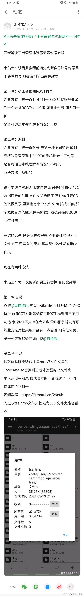
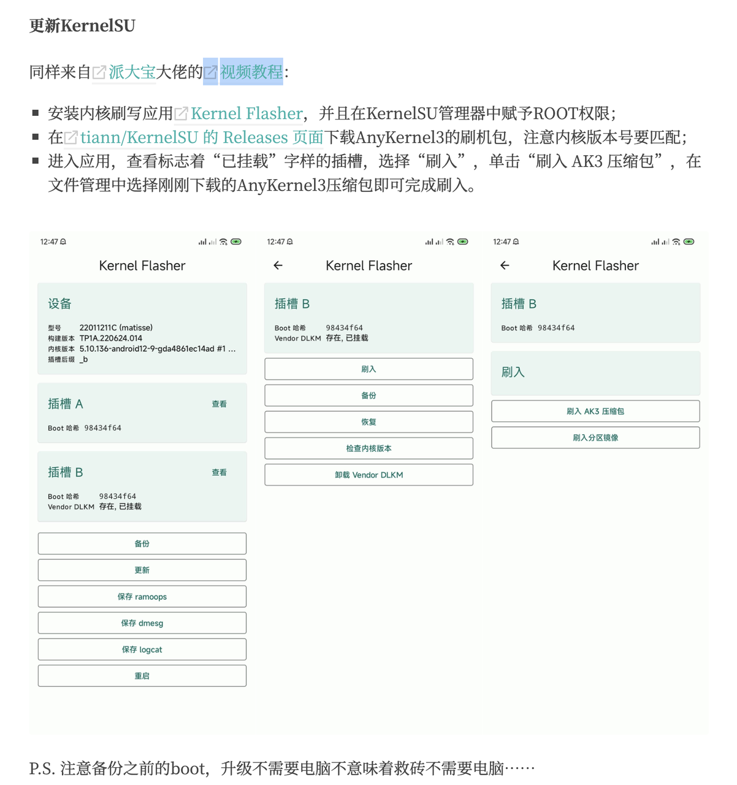

<div align=center>
    <h1>安卓搞机大全收藏</h1>
</div>

# 刷机

## GSI刷机

[Android 刷写Google通用镜像(GSI) - 掘金](https://juejin.cn/post/7184707950617821239)

首先去下载一个线刷包或者卡刷包把vbmeta拿出来，一般在img镜像文件夹中 然后注意不要使用第三方recovery，必须使用官方的，实在搞不明白就线刷官方后操作，注意不要上锁(BL) 然后执行刷入vbmeta镜像： `fastboot flash vbmeta vbmeta.img` 然后重启到fastbooted模式(第三方rec进不去)： `fastboot reboot fastboot` 接着执行刷入GSI镜像的操作，注意文件名一致，这里只是教学的img镜像： `fastboot flash system system-roar-arm64-ab-vndklite-vanilla.img` 最后执行重启到MIUI的recovery: `fastboot reboot recovery` 然后执行下MIUI recovery的恢复出厂设置 最后执行MIUI recovery下的重启，即可进入系统

Not enough space to resize partition

按照此方法设置后报错，需要待解决

your device is corrupt. it can't be trusted and may not work properly

## 线刷方式刷入卡刷包

1. 用mt管理器把卡刷包里的所有镜像文件解压出来
2. 把所有文件移到电脑上，创一个文件夹来装，可以叫“images”
3. 在文件夹同目录执行shell脚本

```Shell
#!/bin/bash

# 初始化
e="echo -e"
sg=">/dev/null 2>&1"
right_device=""
if [ -f bin/right_device ]; then
  right_device=$(cat bin/right_device)
fi

# 显示主菜单
while true; do
  clear
  $e "\033[02m[1].\033[01m保留全部数据刷入\033[0m\n"
  $e "\033[02m[2].\033[01m格式化用户数据\033[0m\n"
  if [ ! -z "$right_device" ]; then
    $e "\033[0C注意:此ROM专为[$right_device]制作，其他机型不可刷入！！！\033[0m\n"
  fi
  $e "\033[08m驱动程序下载\033[0m\n"

  read -p "请选择你要操作的项目：" zyxz
  case "$zyxz" in
    1) xz=1; break ;;
    2) xz=2; break ;;
    *) continue ;;
  esac
done

# 刷机操作
clear
$e "\033[0D手机必须为Bootloader模式, 正在等待设备\033[0m\n"

DeviceCode=$(fastboot getvar product 2>&1 | grep "product" | awk '{print $2}')
fqlx=$(fastboot getvar slot-count 2>&1 | grep "slot-count" | awk '{print $2}')
if [ "$fqlx" == "2" ]; then
  fqlx="AB"
else
  fqlx="A"
fi

# 根据分区类型进行刷机
if [ "$fqlx" == "A" ]; then
  for file in $(ls images | grep -v -i "super.img" | grep -v -i "preloader_raw.img" | grep -v -i "cust.img"); do
    partition=$(basename "$file" .img)
    $e "\033[09m正在刷入${partition}分区文件！\033[0m\n"
    fastboot flash "$partition" "images/$file" $sg
    if [ $? -eq 0 ]; then
      echo "刷入 $partition 完成"
    else
      echo "刷入 $partition 时出现错误-代码$?"
    fi
  done
else
  for file in $(ls images | grep -v -i "super.img" | grep -v -i "preloader_raw.img" | grep -v -i "cust.img"); do
    partition=$(basename "$file" .img)
    $e "\033[09m正在刷入${partition}分区文件！\033[0m\n"
    fastboot flash "${partition}_a" "images/$file" $sg
    fastboot flash "${partition}_b" "images/$file" $sg
    if [ $? -eq 0 ]; then
      echo "刷入 $partition 完成"
    else
      fastboot flash "$partition" "images/$file" $sg
      if [ $? -ne 0 ]; then
        $e "\033[0C刷入 $partition 时出现错误属于正常情况,请无视\033[0E-代码$?\033[0m\n"
      fi
    fi
  done
fi

# 特殊镜像处理
if [ -f images/cust.img ]; then
  fastboot flash cust images/cust.img
fi

if [ -f images/preloader_raw.img ]; then
  fastboot flash preloader_a images/preloader_raw.img $sg
  fastboot flash preloader_b images/preloader_raw.img $sg
  fastboot flash preloader1 images/preloader_raw.img $sg
  fastboot flash preloader2 images/preloader_raw.img $sg
fi

# 处理 zst 文件
for file in images/*.zst; do
  if [ -f "$file" ]; then
    base=$(basename "$file" .zst)
    echo "正在转换 $base"
    zstd --rm -d "$file" -o "images/$base"
    echo "开始刷入 $base"
    fastboot flash "${base%.img}" "images/$base"
  fi
done

# 根据选择进行后续操作
if [ "$xz" == "1" ]; then
  $e "\033[0A已保留全部数据,准备重启！\033[0m\n"
elif [ "$xz" == "2" ]; then
  echo "正在格式化DATA"
  fastboot erase userdata
  fastboot erase metadata
fi

# 设置活动分区并重启设备
if [ "$fqlx" == "AB" ]; then
  fastboot set_active a
fi

# 重启系统或者重启到Rec
# fastboot reboot recovery
fastboot reboot

$e "\033[0A刷机完毕\033[0m\n"
read -p "按任意键退出..."
exit 0
```

## DSU 双系统

本文的前提条件：设备需解锁Bootloader锁，没有可以不用往下看了。

##### 1、下载Treble检测工具检测是否可行

**暂时无法在飞书文档外展示此内容**

##### 2、找到对应的GSI文件进行下载

[小米红米SGSI|GSI镜像下载 - FiimeROM](https://mi.fiime.cn/SGSI_GSI)

[Andy Yan's personal builds // GSI Files](https://sourceforge.net/projects/andyyan-gsi/files/)

##### 3、使用工具开启内核宽容，这里以多系统工具箱为例，在开启ab分区的内核宽容

**暂时无法在飞书文档外展示此内容**

##### 4、关闭avb2.0校验

从刷机包里提取 vbmeta.img，使用下方命令刷入

```Shell
fastboot --disable-verity --disable-verification flash vbmeta vbmeta.img
```

##### 5、使用DSU Sideloader刷入GSI，分配合理的用户空间大小，从通知栏中点击重启

##### 6、如果想实现永久双系统，每次开机直接进动态系统

在新的动态系统中使用如下adb命令

```Shell
adb shell gsi_tool enable
```

##### 参考资料

[安卓系列机型 另类体验第三方系统 DSU操作步骤解析 不影响主系统开启第二系统\_dsu sideloader 下载-CSDN博客](https://blog.csdn.net/u011283906/article/details/132776271)

[细谈Android设备的DSU与GSI | Fosvcat的小窝](https://www.fosvcat.top/post/dsu)

[使用DSU Sideloder实现安卓双系统\_dsu sideloader 下载-CSDN博客](https://blog.csdn.net/weixin_68940353/article/details/138566845)

# 隐藏 root

## momo检测

[解决SELinux处于宽容模式第(一)期 来自 top妙涵 - 酷安](https://www.coolapk.com/feed/52960070?shareKey=ZGE5ZDI1NTZhYjVhNjYwYTllMWE~&shareUid=4161227&shareFrom=com.coolapk.market_13.4.1)

[解决SELinux处于宽容模式第(二)期 来自 top妙涵 - 酷安](https://www.coolapk.com/feed/45100028?shareKey=NjlmNTAzMTNhODQ4NjYwYTllNDk~&shareUid=4161227&shareFrom=com.coolapk.market_13.4.1)

## root检测/隐藏

[隐藏root保姆级教程第(一)期之用“Shamiko”模块隐藏root（转自酷安）](https://www.bilibili.com/read/cv19575757/)

[GitHub - apkunpacker/MagiskDetection: Collection of Some Publically Available POC Apps to Detect Roo](https://github.com/apkunpacker/MagiskDetection/tree/main)

[【王者荣耀体验服】root权限导致封号的解决办法](https://www.bilibili.com/read/cv5730678/)

[GitHub - helloklf/kr-scripts: 使用 xml + linux shell 代码，快速创建使用ROOT权限执行的脚本管理器](https://github.com/helloklf/kr-scripts)

[GitHub - Gladtbam/kr-scripts: 使用 xml + linux shell 代码，快速创建使用ROOT权限执行的脚本管理器](https://github.com/Gladtbam/kr-scripts)



# Xposed研究

## 开发指南

**https://api.xposed.info/reference/packages.html**

### pixel刷机指南

[Pixel XL 刷原生系统，刷Magisk 进行ROOT - TheHIde - 博客园](https://www.cnblogs.com/roothide/p/16554018.html)

[Nexus 和 Pixel 设备的出厂映像  |  Google Play services  |  Google for Developers](https://developers.google.cn/android/images?hl=zh-cn#crosshatch)

magisk官网[Magisk安装教程](https://magiskcn.com/)

[LSPosed - Riru版和Zygisk版安装使用指南【手机改造计划】](https://zhuanlan.zhihu.com/p/527205562)

### 可能遇到的问题

#### LSPosed安装以后桌面找不到LSposed图标？

去/data/adb/modules/目录下找到对应的manager.apk并安装

## 收藏的github仓库

**https://github.com/whitechi73/OpenShamrock**

**https://github.com/ikws4/KXposedHelper**

**https://github.com/Xposed-Modules-Repo/com.lu.wxmask**

**https://github.com/GangJust/xpler**

**https://github.com/Mufanc/AutoX**

### 示例仓库

https://github.com/1fexd/AntiWebView/tree/master

https://github.com/ppawel/twitter-ad-eater/tree/master

https://github.com/Mufanc/AppLock/

https://github.com/qqlittleice/FuckMiuiSystemUI

github搜：EzXHelper，有两个项目

https://github.com/KyuubiRan/EzXHelper

https://github.com/KyuubiRan/EzXHepler-template/

# 实用搞机收藏

## 玩机工具收藏

* 玩机工具大全 https://pan.xunlei.com/s/VNmzVuYKtf\_MyZVjtf6IKVS5A1 提取码：hk29
*

## 小米13解锁刷机

https://kernelsu.com/mi-init-boot

| 模块推荐                                               | 链接                                                                                                                       | 描述                           |
| -------------------------------------------------------- | ---------------------------------------------------------------------------------------------------------------------------- | -------------------------------- |
| LSP
| https://github.com/Xposed-Modules-Repo/com.yifeplayte.maxfreeform                                                          | 解锁任意应用小窗、MIUI界面优化 |
| github.com/Weverses/ModemPro/releases/tag/2.2.0        | 小米基带优化，户外网络信号增强                                                                                             |
| https://github.com/ReChronoRain/Cemiuiler              | MIUI界面优化，功能强大但是不稳定，会崩溃                                                                                   |
| https://github.com/Art-Chen/MIUI-Extra-YukiAPI         | MIUI界面优化                                                                                                               |
| https://github.com/Xposed-Modules-Repo/com.bug.hookvip | VIP破解模块                                                                                                                |
| Magisk                                                 | https://magisk.suchenqaq.club/query.php?file\_type=magisk&is\_classification\_list=false&classification=systemOptimization | 微信进程清理 [(2023.8.29重制更新)这是一个微信极致省电压后台教程(无法用fcm推送的看过来) 来自 橘神ovo - 酷安](https://www.coolapk.com/feed/55086805?shareKey=MjlhMTY5NTJlMTE3NjYxOGQ2MDk~&shareUid=23814485&shareFrom=com.coolapk.market_14.1.0) |

## 玩机资源

[基于 KernelSU 的 Redmi K50Pro 玩机方案 - alpacabro](https://www.alpacabro.com/archives/root-my-redmi-phone.html)

[史上最简便好用的root隐藏方案!!! 来自 奔腾的小猪 - 酷安](https://www.coolapk.com/feed/46564699?shareKey=N2IxNTdmNDA0NWRhNjQ5M2I3ODI~&shareUid=2392038&shareFrom=com.coolapk.market_13.1.5)



## 一个以冻结为核心的后台优化Xposed模块

[快速开始 | NoActive](https://app.myflv.cn/guide/start.html)

## mac投屏

[mac系统通过ADB与scrcpy实现手机投屏\_adb 苹果电脑投屏服务-CSDN博客](https://blog.csdn.net/ssmbyss/article/details/116449657)

## 安装adb和scrcpy

```Shell
# 安装ADB
brew cask install android-platform-tools
# 安装scrcpy
brew install scrcpy
# USB投屏
scrcpy -m 1024
# 熄屏投屏
scrcpy --turn-screen-off
```

### 经常使用的几个快捷键是：（Windows下）

ALT+o 保持投屏同时手机熄屏

ALT+SHIFT+O 点亮手机屏幕

ALT+P 相当于按电源键。

ALT+R 旋转屏幕

作者：期待小幸运 [分享下自己的scrcpy手机投屏命令](https://www.bilibili.com/read/cv18741327/) 出处：bilibili

**https://www.fosvcat.top/post/dsu**

**https://www.fosvcat.top/post/android**

澎湃IOS主题

## 相关资源

需要多个模块混合搭配

相关资源：

超级起源（ios锁屏主题）

超纪元Ultra（可以搭配自定义图标，图标放在 /MIUI/DIIY/ 目录下）

IOS控制中心（Eg Life）

堆叠桌面（ios后台，有多个不同的版本）

iOS状态栏、小白条（主题里面把systemui这个包替换一下就行）

灵动岛（直接用官改包）
